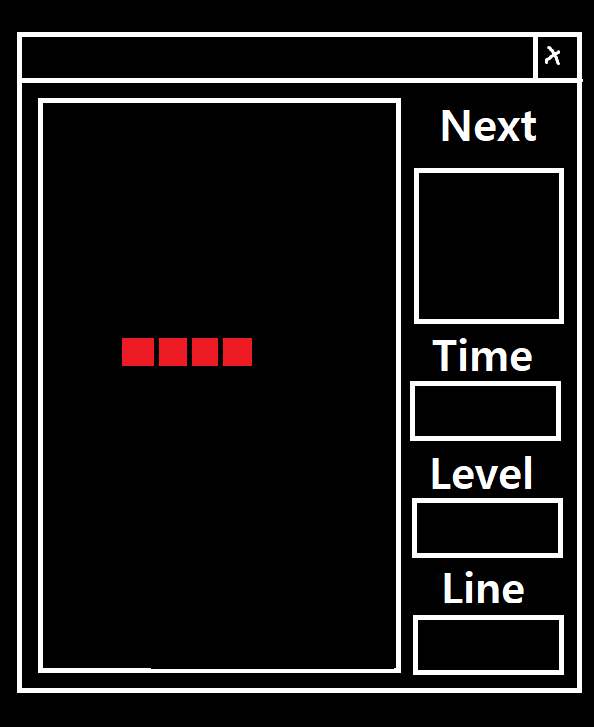

# 게임 레이아웃 디자인 계획
- 작성자 : 최지원
  

## 게임 레이아웃 디자인 계획

게임 레이아웃 디자인은 아래의 이미지와 같이 하기로 정했습니다.  
그림판을 이용해서 그림이 이상합니다.    
  
  

## 게임 레이아웃 디자인 설명

왼쪽의 테트로미노가 있는 영역은 게임 플레이영역 입니다.
Next가 있는 영역은 다음에 게임 플레이영역에 배치될 테트로미노를 보여줍니다.  
Time이 있는 영역은 현재 레벨의 남은 시간을 보여줍니다.  
Level이 있는 영역은 현재 플레이어의 레벨를 보여줍니다.  
Line이 있는 영역은 게임 플레이중 삭제한 라인 수를 보여줍니다.  
  

## Note
- 이때, 윈도우의 크기는 변하지 않도록 구현합니다.  
- 디자인 그림에는 테트로미노의 색상이 단순 원색으로 표현되어 있지만, 실제 게임에서는 미리 준비한 텍스처를 활용합니다.
